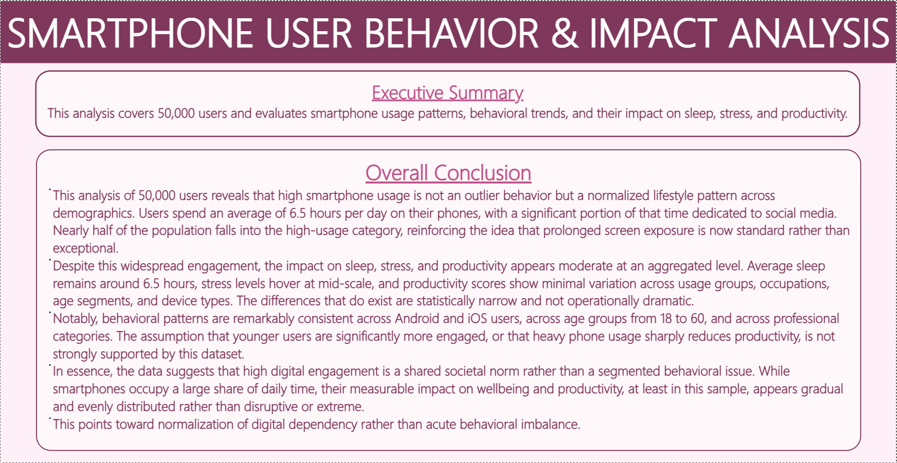
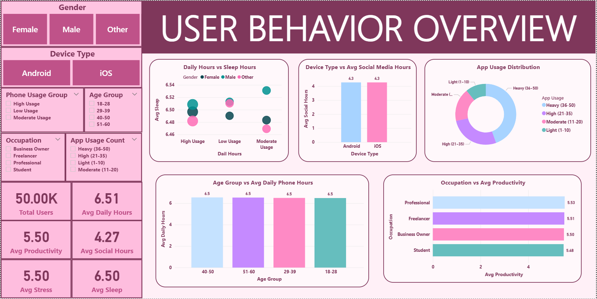

<div align="center">

# 📱 Smartphone Usage & Well-Being Analysis

### *Does your phone own you — or do you own it?*


</div>

---

## 🔬 What Is This Project About?

This project digs into the real relationship between **smartphone habits and human well-being** — across **50,000 users**.

We set out to test a popular assumption:

> *"Heavy phone use = more stress, less sleep, lower productivity."*

Spoiler: **the data tells a different story.**

Using **SQL**, **Python**, and **Power BI**, we examined how daily phone usage, social media hours, app counts, and caffeine intake interact with stress, sleep duration, and productivity scores — sliced across age, gender, occupation, and device type.

---

## 🧩 The Query Engine

Ask business questions in plain English — no SQL needed.

**Example queries:**
- *"Total revenue"*
- *"Top 5 users by stress level"*
- *"Average sleep by occupation"*
- *"Compare productivity by device type"*

| Step | Component | What It Does |
|------|-----------|--------------|
| 1 | `data_cleaning.ipynb` | Parses raw data, creates age/app-usage groups, validates types |
| 2 | `data_visualization.ipynb` | Generates charts, correlation matrices, and grouped comparisons |
| 3 | `smartphone.pbix` | Produces an interactive Power BI dashboard with drill-down filters |

---

## 📊 Key Metrics

| Metric | Value |
|--------|-------|
| Users Analyzed | **50,000** |
| Features Tracked | **12+** |
| Dashboard Pages | **2** |
| Avg Daily Phone Use | Analyzed across groups |
| Correlation (Usage → Stress) | **Weak** |

**Headline Findings:**
- 📉 No significant gender-based behavioral difference
- 📱 Device type doesn't meaningfully shift usage patterns
- 😴 Age-based sleep differences are marginal
- 💼 Occupation doesn't strongly predict productivity
- 🔗 Heavy phone use ≠ high stress (correlation is weak)

---

## 👥 User Behavior Segments

Users were grouped by usage intensity and behavioral patterns into four segments:

| Segment | Description |
|---------|-------------|
| 🏆 Heavy Users | High daily hours, high app engagement |
| 📊 Moderate Users | Average usage, balanced behavior |
| 🌿 Light Users | Low screen time, fewer apps |
| ☕ Caffeine-Linked | High caffeine, correlated usage patterns |

**Key insight:** Behavioral patterns remain remarkably *consistent* across all demographics — the dominant theme is **stability, not disparity.**

---

## ⚡ Supported Capabilities

- ✅ MySQL database connection + SQL extraction
- ✅ Group-by analysis (age, gender, occupation, device)
- ✅ Correlation matrices and distribution plots
- ✅ Power BI interactive dashboard (2 pages)
- ✅ Modular, notebook-based architecture

## ❌ Current Limitations

- ❌ No time-series analysis (longitudinal tracking)
- ❌ No real-time data integration
- ❌ Psychological/contextual variables not included
- ❌ Rule-based analysis only — no ML model

---

## 📈 Power BI Dashboard Preview

> Full interactive dashboard covering usage behavior, stress trends, and demographic breakdowns.

**Page 1 — User Behavior Overview**
- Total Users · Avg Daily Hours · Avg Stress · Avg Sleep · Avg Productivity
- App Usage Distribution · Age & Occupation Comparisons



**Page 2 — Impact Analysis**
- Heavy Usage % · Stress vs Daily Hours
- Productivity vs App Usage · Social Media vs Productivity



📂 To explore the full dashboard, open `powerbi/smartphone.pbix` in Power BI Desktop.

---

## 🛠️ Tech Stack

Python · Pandas · NumPy · Matplotlib · Seaborn · MySQL · SQLAlchemy · Power BI · Jupyter Notebook

---

## 📁 Project Structure

```
Smartphone_Analysis/
│
├── 📂 data/
│   └── smartphone.csv              ← Raw dataset (50,000 users)
│
├── 📂 images/
│   ├── img.png
│   ├── img_1.png
│   └── img_2.png                   ← Dashboard & chart exports
│
├── 📂 notebooks/
│   ├── data_cleaning.ipynb         ← Data prep, group creation
│   └── data_visualization.ipynb   ← EDA, correlation, plots
│
├── 📂 powerbi/
│   └── smartphone.pbix             ← Interactive dashboard
│
├── 📂 report/
│   └── smartphone.docx             ← Full analytical report
│
└── README.md
```

---

## 🚀 How to Run

**1. Clone the repository**
```bash
git clone https://github.com/manasi-2408/Smartphone_Analysis.git
cd Smartphone_Analysis
```

**2. Install Python dependencies**
```bash
pip install pandas numpy matplotlib seaborn mysql-connector-python sqlalchemy pymysql
```

**3. Launch Jupyter & run notebooks in order**
```bash
jupyter notebook
# Step 1: notebooks/data_cleaning.ipynb
# Step 2: notebooks/data_visualization.ipynb
```

**4. Open the dashboard**
```
powerbi/smartphone.pbix  →  Open in Power BI Desktop
```

---

## 🎯 Final Conclusion

> **Smartphone usage intensity does not meaningfully affect stress, sleep, or productivity in this dataset.**

Behavioral patterns remain stable across demographic and occupational segments. Common assumptions about heavy smartphone use leading to negative well-being outcomes are **not strongly supported** by this data.

The dominant theme observed: **consistency, not chaos.**

---

<div align="center">

Made with 💜 by [Manasi](https://github.com/manasi-2408)

*If this project helped you, drop a ⭐ — it means a lot!*

</div>
